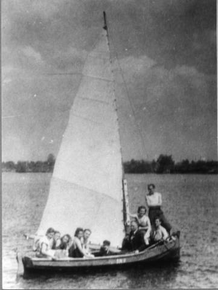
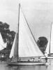
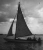
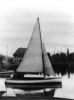
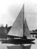
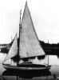
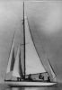
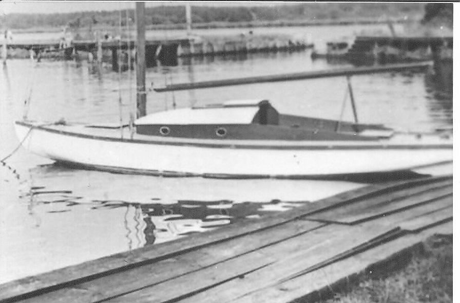
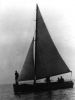
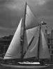

Zobacz też: 

* [Kalendarium regatowe](../kalendarium-regatowe/) oraz
* [Komandorzy Jacht Klubu AZS w Szczecinie od 1946 r.](../../sprawy-klubowe/komandorzy/)

# Kalendarium JK AZS

Od tych jachtów się zaczęło:

| [Szalupa](jacht-szalupa)             | Maciek                 | Kaczorek                    | Przygoda                   | Tuńczyk                  | Meduza                 |
| ------------------------------------ | ---------------------- | --------------------------- | -------------------------- | ------------------------ | ---------------------- |
|  |  |  |  |  |  |

| Nadir                | Wicher                             | Kania                | [Witeź II](https://www.kulinski.navsim.pl/art.php?id=3087) | Swantewit                    |
| -------------------- | ---------------------------------- | -------------------- | ---------------------------------------------------------- | ---------------------------- |
|  |  |  |                                     |  |

## Lata 1946-1989 opracował Ziemowit Ostrowski

### 1946

Narodziny akademickiego żeglarstwa w Szczecinie wyprzedziły inaugurację pierwszej wyższej uczelni tego miasta - Akademii Handlowej. Sekcja Żeglarska Akademickiego Związku Sportowego powstała 12 listopada 1946 roku.

### 1947

Z multidyscyplinarnego AZS-u, po 4 miesiącach, przeniosła się do czysto żeglarskiego Akademickiego Związku Morskiego.

### 1948

AZM przejmuje przystań na Gocławiu z tzw. Pałacem Jachtowym (dawniej St.YC).

### 1949

Nakazane połączenie AZM i AZS, powrót do formy Sekcji Żeglarskiej AZS. Podjęto starania o kilka wraków jachtów i kiedy władze w roku 1949 wymusiły włączenie AZM do AZS, jachty Maciek i Kaczorek miały za sobą już cały sezon pływania. Na pierwsze po wojnie szczecińskie regaty, które odbyły się 18 września 1949 r., sekcja wysłała już 5 jednostek.

### 1952

W ramach stalinowskiej akcji izolowania miasta od portu, Wojska Ochrony Pogranicza wywłaszczyły AZS ze znakomitej przystani przy tzw. Pałacu Jachtowym na Gocławiu. Sekcja zagospodarowała opuszczoną wyspę na Odrze Zachodniej, tworząc tam sprawne zimowisko. W tym okresie jedynym akwenem swobodnej żeglugi było jezioro Dąbie. Odległość do niego dyskwalifikowała wyspę jako bazę letnią.

### 1954

Rozpoczęto starania o budowę przystani żeglarskiej nad jeziorem. Obiekt powstał i jest od połowy lat 50. stale rozbudowywaną przystanią Jacht Klubu AZS,

### 1955

Wojewódzki Komitet KF zleca AZS rolę inwestora Centralnej Przystani Żeglarskiej.

### 1959

Rejsami do Islandii i dookoła Anglii Witeź II wchodzi do historii żeglarstwa polskiego. Obok szkolenia i turystyki od 1949 r. AZS rozwija działalność regatową, początkowo na jachtach balastowych, później także mieczowych. Pierwszym znaczącym sukcesem w kraju było zdobycie w 1952 r. II miejsca w I Mistrzostwach Polski Jachtów Balastowych, a na arenie międzynarodowej - zwycięstwo "Swantewita" w regatach dookoła Rugii. Organizowane od 1951 r. przez JK AZS "Regaty Przyjaźni" są najstarszymi na Pomorzu Zachodnim, corocznie przeprowadzanymi przez tego samego organizatora regatami. W 50-letniej historii klubu nasi zawodnicy startowali w klasach: "P 7", "H", "Omega", "Słonka", "Star", "Finn", "Laser", "OK-Dinghy", "Cadet", "Optymist", "FD", "Hornet", "420", "470", "Folkboat", "Dragon", "Soling", "deska z żaglem" oraz w klasach jachtów morskich, uzyskując wiele znaczących sukcesów. Więcej o sukcesach grupy regatowej można przeczytać w liście Joli Boehm, która była przez wiele lat trenerem w JK AZS, a obecnie mieszka w Australii.

### 1967

Przekazanie wyspy na Pomorzanach Politechnice Szczecińskiej.

### 1970

W latach 70. flotylla klubowa liczyła około 100 jednostek, zaś liczba członków przekraczała 500 osób. Następcą "Witezia" był "Pegaz", który m.in. jako jeden z pierwszych polskich jachtów osiągnął północny koniec Bałtyku (1969). Zbudowane przed 1931 rokiem "Swantewit", "Nadir" i "Nord" należą do najstarszych wśród eksploatowanych w Polsce jachtów. "Dal II", "Żak", "Bonito" i znany z popularnej piosenki żeglarskiej "Umbriaga", zaznaczały swoje istnienie raczej wynikami regatowymi, choć odbyły też wiele rejsów turystycznych po Morzu Północnym, Śródziemnym, Czarnym, Egejskim i Adriatyku. "Gryfita" pływał m.in. na Wyspy Kanaryjskie (1976), a "Gaudeamus" odbył w latach 1986-87 rejs do USA. Najznakomitsze osiągnięcia rejsowe Klubu wiążą się z osobą Ludomira Mączki (w klubie od 1949 r.), uczestnika rejsu "Witezia II" do Islandii, 4-letniej wyprawy "Vagabonda II", w trakcie której wraz z drugim członkiem Klubu, Wojciechem Jacobsonem, dokonali pierwszego w historii przejścia jachtem od Cieśniny Beringa do Grenlandii, wreszcie kapitana w 18-letnim rejsie swoją "Marią" dookoła świata (1973-1991 ). Na poszczególnych etapach tego pływania towarzyszyło "Ludojadowi" kilku klubowych kolegów.
Poczet honorowych członków klubu otwiera "Kapitan Kapitanów" Konstanty Maciejewicz. Żeglarze JK AZS jako kapitanowie dowodzili w wielu znaczących rejsach, jako zawodnicy zdobyli w regatach wiele medali, tytułów i nagród, jako sędziowie prowadzili setki imprez - od lokalnych do międzynarodowych, jako działacze byli członkami kierownictw: krajowego, akademickiego i szczecińskiego żeglarstwa.

### 1989

Od 1989 r. Jacht Klub AZS skutecznie adaptuje się do nowych warunków, w jakich działa polski sport. Pozbawiony dotacji i etatów szybko dostosował zakres działalności do realiów. Pomogła w tym pięćdziesięcioletnia tradycja klubowej aktywności i efektywnej pracy. Fakt pozostania największym klubem żeglarskim Pomorza Zachodniego może być miarą sukcesu. Aktualnie Klub zrzesza 243 członków i jest najliczniejszym Klubem na Pomorzu Zachodnim, przodując jednocześnie w wyszkoleniu swych żeglarzy, o czym świadczy ilość posiadanych przez nich stopni.

## Lata 1991-2011 opracował Zenon Szostak

### 1990

05/06   rejs„Gaudeamusem” do Anglii; Dover, cieśnina Solent, Wyspa Wight; kpt. K. Vorbrich

06/08   rejs „Gaudeamusem” na Operację Żagiel; kpt. W. Zdrojewski

### 1991

21.05. zakup szalupy żaglowo-wiosłowej typu DZ „SUM” (zbudowana w Stoczni Jachtowej im. L. Teligi w Szczecinie w 1986r.)

28.07. powitanie „Marii” i Ludka Mączki (powrócił razem z grupą jachtów polonijnych w ramach Zlotu Jachtów Polonijnych w Polsce); wypłynął z Klubu 06.09.1973 (Ludek Mączka, Jerzy Mańkowski, Wojciech Jacobson); powrót po wokółziemskim rejsie, ok. 70 tys. Mm

19.10. chrzest morski w Klubie jachtu poznańskich żeglarzy akademickich „Polonus”

### 1992

Przebudowa jachtu „Gaudeamus”– wnętrze, mesa, kabina kapitańska i „Dali II”– pokład, kokpit, wg rysunków Z. Ostrowskiego.

### 1993

Roczny czarter „Gaudeamus” (część załogi z Klubu); rejs na Wyspy Kanaryjskie.

### 1994

22.06.  powrót „Gaudeamusa” po rocznym czarterze

08/09   rejs „Dalą II” do Norwegii (Oslo); kpt. Z. Ostrowski

### 1995

31.03   walne Zebranie Klubu; Zbigniew Gerlach zostaje Komandorem Klubu

08/09   rejs „Dalą II” do Sztokholmu; kpt. Z. Ostrowski

4.11 przystań zalana bardzo wysoką wodą (cofka, silne wiatry); 10 cm powyżej pomostów

### 1996

15.04 zmarł Witold Pajewski

18.05 otwarcie sezonu 50-lecia żeglarstwa akademickiego na Pomorzu Zachodnim; odsłonięcie pamiątkowej tablicy na kamieniu – głazie narzutowym z Puszczy Bukowej; kamień dostarczony staraniem T. Kubiaka, tablicę wg projektu Z. Szostaka (inicjatora przedsięwzięcia) wykonała z brązu odlewnia (Zb. Górkiewicz);

8.06. spotkanie „dinozaurów” Klubowych

30.06 - 17.07. rejs w ramach obchodów 50-lecia Klubu do Helsingborga i Kopenhagi; „Gaudeamus” (kpt. L. Mączka), „Bonito” (kpt. H. Kuźnicka), „Żak” (kpt. U. Teodorczyk), „Umbriaga” (kpt.

 W. Kuźnicki), „Dal II” (kpt. Z. Ostrowski)

21.07 - 22.08. rejs „Dalą II”do Bergen (Norwegia); kpt. Z. Ostrowski

 6 – 7.09. XLVI Regaty Przyjaźni jachtów balastowych

 21 - 22.09. Regaty Przyjaźni jachtów mieczowych

### 1997

01.08 – 24.08.  rejs „Dalą II” do Sztokholmu; kpt. Z. Ostrowski

29.06 – 23.07.  rejs „Dalą II” do Hamburga i Thyboron; kpt. Z. Ostrowski

### 1998

(30.01.98) Zmarł Feliks Wodziński - założyciel SŻ AZS w Szczecinie w 1946 r., później prezes oddziału AZM; pionier żeglarstwa akademickiego na Pomorzu Zachodnim. Jego prywatna łódź była pierwszą jednostką klubową, która służyła wszystkim akademickim żeglarzom.

(30.06 -10.09.98) "Smuga cienia" na Tall Ships Races; 4956 Mm, 2,5 m-ca; Anglia, Portugalia, Hiszpania, Irlandia, Anglia.

(09.08.98) "Dal II" tonie na podejściu do Tamizy, po wejściu na mielizną koło Margate.

### 1999

(23.06 - 27.08.99) "Smuga cienia" na Tall Ships Races; 3337,5 Mm, 2 m-ce; Francja, Szkocja, Hebrydy, Szetlandy, Dania.

(31.07.99) Ludomir Mączka wypływa w drugi rejs dookoła świata.

### 2000

(21.10.00) Zbigniew Górkiewicz z jachtu "Vagari" uratował 6 osób z wywróconej Omegi Klubowej i zmarł natychmiast po tym wysiłku.

### 2001

(01.03.01) Wojciech Jacobson jako pierwszy członek Klubu minął Horn (na Concordii, jako I of).

### 2002

Nagroda "Super Kolos" 2001 dla Ludomira Mączki.
"Smuga cienia" do Hiszpanii, Francji, Anglii na Tall Ships Races.
"Stary" wychodzi w rejs Cape Horn - Antarctica (załoga ze Śląska - studenci).

### 2003

(29.03.03) "Stary" minął Horn (kpt. J. Wacławski - 22 lata).

(01.04.03) "Stary" na Antarktydzie (Wyspa Georgia Szetlandy Płd.).

(28.06.03) "Muzyka na wodzie" - koncert filharmoników szczecińskich na przystani JK AZS; prowadzenie Jan Waraczewski.

(30.08.03) Powitanie "Marii" w Klubie; rejs ukończył Maciej Krzeptowski; Ludomir Mączka odbiera cumy.

(27.09.03) "Stary" cumuje przy kei po powrocie z Hornu i Antarktydy. Powitanie w Klubie.

### 2004

I nagroda Rejs Roku 2003 i Srebrny Sekstant dla kpt. Jacka Wacławskiego i załogi jachtu "Stary" za wyprawę Cape Horn - Antarctica 2002/2003.
III nagroda Rejs Roku dla Ludomira Mączki i Macieja Krzeptowskiego za rejs wokółziemski jachtem "Maria".

(13.03.04) Ziemowit Ostrowski i Ludomir Mączka - otrzymują Honorowe Członkostwo w PZŻ.

(21.08.04) "Muzyka na wodzie" - koncert filharmoników szczecińskich.

### 2005

(05.03.05) Henryk Widera - nagroda Kolos 2004 w kat. żeglarstwo.

(02.07.05) "Muzyka nad wodą" - koncert filharmoników szczecińskich.

### 2006

(30.01.06) zmarł Ludomir Mączka - poniedziałek 16.00 w hospicjum św. Jana Ewangelisty w Szczecinie - Golęcinie; pogrzeb 06.02.2006.

(06.05.06) Otwarcie sezonu żeglarskiego na przystani JK AZS ; obchody 60-lecia żeglarstwa akademickiego na Pomorzu Zachodnim i 100 lat jachtu "Nadir".

(11.05.06) Henryk Widera (76 l.) na jachcie "Gawot" (typ Tango Family) wypływa w samotny rejs dookoła Europy.

(26.05.06) "Stary" wypływa w rejs na North West Passage (Przejście Północno-Zachodnie w Arktyce Kanadyjskiej).

(17.06.06) Koncert na wodzie filharmoników szczecińskich pod dyrekcją J. Waraczewskiego; gościnnie występują soliści Romana Jakubowska-Handke i Piotr Śledziński.

(19.09.06) "Stary" przepłynął Cieśninę Beringa - North West Passage zdobyte!!! (najmłodsza załoga w historii NWP: studenci, śr. wieku 25 lat).

(30.09.06) "Śpiewające żagle" - koncert szantowy (Willy Kryska - organizator).

(30.12.06) "Stary" i "Nekton" otrzymuja I nagrodę Rejs Roku za NWP; Srebrny Sekstant dla Jacka Wacławskiego; III nagroda Rejs Roku dla Grzegorza Jendroszczyka za rejs "Starym" ze Szczecina do Grenlandii.

### 2007

(14.01.07) spotkanie w tawernie klubowej z Heniem Widerą; przyjechał z Grecji, gdzie na wyspie Psara zostawił wyciągnięty na ląd swój jacht "Gawot".

(25.02.07) spotkanie w tawernie klubowej z Mariolą Landowska (Lisbona); prezentacja jej podróży do Amazonii.

(09.03.07) "Stary" w drodze powrotnej z NWP przepływa przez Kanał Panamski.

(22.03.07) na trawniku klubowym ustawiliśmy kamień (potężny granit skandynawski, polodowcowy) dla uczczenia pamięci Ludka Mączki.

(12.05.07) otwarcie sezonu żeglarskiego w Klubie i odsłonięcie Ludkowego głazu.

(23.06.07) V koncert nad wodą filharmoników szczecińskich pod dyr. Janka Waraczewskiego; soliści - L. Ślesiński i B. Wardak.

(04.-07.08.07) finał The Tall Ships Races w Szczecinie.

(17.-19.08.07) VI Regaty Unity Line na trasie Świnoujście - Kołobrzeg.

(28.-29.09.07) "Śpiewające Żagle" - koncert szantowy (Willi Kryska - organizator).

(03.10.07) spotkanie w tawernie klubowej z Jerzym Kuśmiderem - żeglarzem polonijnym z Kanady (Vancouver).

(12.07) nagroda na festiwalu Sprtlimfestival w Palermo dla K. Kulika za film "W poszukiwaniu legendy" (film o wyprawie "Starego" na NWP).

(31.12.07) Honorowe wyróżnienie nagroda TVP SA "Rejs Roku 2007" dla Dominika Baca i Sławka Skalmierskiego za rejs jachtem "Stary" z Vancouver do Key West (Floryda).

### 2008

(24.01.08) zmarł Jerzy Siudy.

(03.02.08) spotkanie z Heniem Widerą w tawernie klubowej; pokaz filmu z jego rejsu dookoła Europy.

(06.-08.03.08) nagroda Kolosy w kategorii żeglarstwo dla załogi jachtu "Stary" za NWP.

(28.06.08) koncert nad wodą filharmoników szczecińskich po dyr. J. Waraczewskiego; solistka - Joanna Rawik.

(02.07.-30.08.08) "Gaudeamus" w Tall Ships Races - III miejsce (kpt. R. Hołdakowski).

(27.07.-05.08.08) szalupą wiosłowo-żaglową DZ "SUM" dookoła Bornholmu (kpt. M. Jósewicz).

(15.-17.08.08) VII Regaty Unity Line na trasie Świnoujście - Kołobrzeg - Świnoujście.

(31.08.-30.09.08) "Stary do Szkocji i fiordów norweskich (kpt. M. Śliwiński).

(20.09.08) "Śpiewające Żagle" - koncert szantowy (Willi Kryska - organizator).

(24.09.08) wizyta w Klubie Krzysztofa Kamińskiego - polonijnego żeglarza z Chicago; sponsoruje Nataszę Caban w jej samotnym rejsie dookoła świata.

(11.10.08) powitanie Henia Widery powracającego z rejsu dookoła Europy.

(18.10.08) spotkanie w klubowej tawernie z Krzysztofem Jaworskim - członkiem Klubu w latach czterdziestych i pięćdziesiątych ubiegłego wieku; pokaz starych zdjęć i klubowe opowieści.

(07.11.08) 60 lat w żeglarstwie akademickim i 85. urodziny Ziomka Ostrowskiego; pokaz zdjęć.

(30.12.08) nagroda Rejs Roku 2008 (II nagroda ex equo) dla Henryka Widery za rejs dookoła Europy; nagroda miesięcznika "Jachting" Jachtsmen 2008 w kategorii samotny żeglarz dla Henryka Widery.

### 2009

(10.01.09) nagroda główna Szczeciński Rejs Roku 2008 dla Henryka Widery za  rejs jachtem „Gawot” dookoła Europy (Szczecin – Norwegia – Szetlandy – Irlandia – Wlk. Brytania – Francja – Hiszpania – Włochy – Grecja – Turcja – Bułgaria – Rumunia -Ukraina - Rostów n/Donem –Ukraina – przewóz jachtu lądem do Polski – częściowa żegluga Wisłą do Gdańska – Szczecin); wyróżnienia Szczeciński Rejs Roku 2009 dla jachtu „Stary” (żegluga na M. Północne i do Norwegii), dla jachtu „Gaudeamus” za udział i III m. (w swojej klasie) w Tall Ships Races i dla DZ-ty „SUM” (M. Jósewicz; rejs odkrytopokładową, balastowo-mieczową łodzią wiosłowo-żaglową na  Bornholm; średnia wieku załogi – 65 lat).

(25.01.09) pokaz filmu i spotkanie w tawernie klubowej z Henrykiem Widerą – Jachtsmenem Roku 2008, laureatem nagrody Rejs Roku 2008 (II nagroda) i głównej nagrody Szczeciński Rejs Roku 2008; bardzo dużo ludzi, media.

(22.03.09) wyróżnienie na gdyńskim przeglądzie Kolosy dla Henryka Widery i prestiżowa nagroda dziennikarzy.

(04.04.09) honorowe członkowstwo dla Marii Gerlach i Stanisława Tomaszewskiego (uczestnicy rejsu „Witezia II” na Islandię w 1959 r.).

(09.05.09) okręgowe otwarcie sezonu żeglarskiego w Klubie.

(31.05.09) uroczyste pożegnanie „Starego” na Wałach Chrobrego -  wypływającego w rejs na Islandię (kpt. M. Krzeptowski).

(24.06.09) Heniu Widera wypłynął „Gawotem” w rejs do Rosji (Petersburg); w planach żegluga kanałami i rzekami na płd. Rosji do Rostowa n/Donem, a potem na płn. Do Murmańska.

(27.06.09) koncert filharmoników szczecińskich pod dyr. Jana Waraczewskiego.

(11.07.09) nocny koncert jazzowy na betonowcu (płn. Kraniec jez. Dąbie); słuchacze na jachtach zakotwiczonych przy betonowcu.

(05-18.07.09) rejs DZ-tą do Kopenhagi i z powrotem (M. Jósewicz, St. Bolewicz, K. Marski, G. Czarnecki)

(14-16.08.09) IX Regaty Unity Line.

(05-06.09.09) LIX Regaty Przyjaźni.

(19.09.09) „Śpiewające Żagle” – szanty, muzyka irlandzka; organizator Willi Kryska.

(28.09.09) H. Widera powrócił z Petersburga; zostawił tam jacht wyciągnięty na ląd, czyni starania o uzyskanie zezwolenia na pływanie po rzekach Rosji – na razie bezskutecznie; wiosną przyszłego roku zamierza kontynuować rejs.

(12.09.09) główna nagroda szczeciński Rejs Roku dla wyprawy „Starego” na Islandię (kpt. M. Krzeptowski); wyróżnienie szczeciński Rejs Roku dla DZ „SUM” (M. Jósewicz) za rejs do Kopenhagi.

(30.12.09) ogólnopolskie wyróżnienie Rejs Roku 2009 dla wyprawy islandzkiej jachtem „Stary” (kpt. M. Krzeptowski).

### 2010

(17.01.10)   Maciek Krzeptowski (z naszego Klubu), Jana Dwojewska-Krzeptowska i Kazimierz Sawczuk dołączyli do  Karoliny i Czecha na żeglugę jachtem „Manui” w kanałach Patagonii.

(04.03.10)   zmarł Paweł Morzycki – dziennikarz „Żagli”, od wielu lat członek naszego Klubu.

(06.03.10)   Wojtek Jacobson otrzymał nagrodę Bałtyckiego Bractwa Żeglarzy Conrad 2009  uroczystość  w  Centralnym Muzeum Morskim na Ołowiance w Gdańsku; Conrady to prestiżowa nagroda za indywidualności morskie).

(10.04.10)   Henio Widera wyjechał do Petersburga (Rosja) na pozostawiony tam w ubiegłym sezonie jacht  „Gawot”; jego zamiarem jest żegluga kanałami rosyjskimi z Petersburga do Moskwy.

(10.04.10)   z powodu tragicznej tragedii narodowej – katastrofa lotnicza prezydenckiego samolotu z Parą Prezydencką i najważniejszymi osobami w Państwie, pod Smoleńskiem, w drodze na uroczystości Katyński – walne zebranie Klubu przeniesione na inny termin

 (24.04.10)   walne zebranie w Klubie; Piotr Stelmarczyk został honorowym członkiem Klubu.

(15.05.10)   otwarcie sezonu żeglarskiego w Klubie.

 (21-23.05.10)   Studenckie 31. Międzynarodowe Regaty Rowerów Wodnych (Internalionale Water Bike): organizator  Wydział Techniki Morskiej ZUT (dawniej PS).

 (03.06.10)   Karolina Podlaszewska (z naszego Klubu, z załogi „Gaudeamusa”) wyrusza z Crosshaven (Irlandia) w rejs z Czechem  Ondrejem Kotab na zakupionym i remontowanym w Irlandii jachcie „Manui”    (stalowy 20letni Chatam  z Belgii).

XIV Regaty o Bukiet Jeziora Dąbie.

(26.06.10)   Muzyka nad wodą” koncert filharmoników szczecińskich pod dyr. Jana Waraczewskiego; gościnnie wystąpiły solistki Gliwickiego Teatru Muzycznego Anita Maszczyk – sopran i Wioletta Białk – sopran.

(07.08.10)   zmarł Kazimierz Rypiński (90 l.); w młodości członek sekcji żeglarskiej AZS(w latach 40tych i 50tych ub wieku); razem z J. Demczukiem i K. Haską na jachcie „Wojtek” zwyciężył w I Regatach Przyjaźni w 1951r. 

(08.10)   Heniu Widera dopłynął „Gawotem” do Moskwy (jacht wyslipował w  Moskwie i powrócił do Szczecina).

(13-15.08.10)   X Regaty Unity Line.

(04-05.09.10)   LX Regaty Przyjaźni.

(25.09.10)  „Śpiewające Żagle” – szanty, muzyka irlandzka; organizator Willi Kryska.

### 2011

(18.01.11)   zmarł Józef Demczuk – członek naszego Klubu od 1951r; komandor Klubu w latach  1987 – 1988; to z jego inicjatywy w Klubie na naszej przystani Klubowej przy ul Przestrzennej stoi okazały maszt  flagowy jako centralny punkt wszystkich oficjalnych uroczystości Klubowych.

(10.03.11) zmarł Ziemowit Ostrowski – wielka postać żeglarstwa akademickiego (od lat 40tych ub.w żeglarstwie akademickim), w latach 1956-58 I Prezes Jacht Klubu AZS, sędzia regatowy, działacz sportowy,  żołnierz Szarych Szeregów, zasłużony w walce o niepodległość  wolnej Polski; pogrzeb z honorami wojskowymi.

(13.03.11)   wyróżnienie Kolosy w kategorii żeglarstwo dla Michała Jósewicza  za morskie rejsy odkryto pokładową  DZ-tą.Wojtek Jacobson po dziesięciu latach zasiadania w Kapitule nagrody Kolosy na własna prośbę zakończył pracę w Kapitule.

(04.11)  Henryk Widera wyjechał do Rosji, do Moskwy, celem kontynuowania swojego rejsu kanałami rosyjskimi na Południe do Rostowa.

(05.06.11)   XV Damskie Regaty o Bukiet Jeziora Dąbie.

(06.11)   rozbudowa przystani o dodatkowe pomosty pływające firmy Marinetek; rozbudowa w ramach Zachodniopomorskiego Szlaku Żeglarskiego przy współfinansowaniu Uni Europejskiej (Regionalny Program Operacyjny).

(21.06.11)   decyzją władz Miasta Szczecin nadanie tytułu Honorowy Ambasador Szczecina dla Wojciecha Jacobsona  (jest to już druga osoba z naszego Klubu; wcześniej Maciej Krzeptowski).

(25.06.11)   IX koncert „Muzyka nad wodą”; muzyka filmowa.

(13.07.11)   Heniu Widera w Petersburgu; nie otrzymał zgody na dalsze żeglowanie kanałami Rosji i został zmuszony do przewiezienia jachtu (samochodem) do Petersburga i opuszczenia Rosji; wypływa do Finlandii.

(08.11)    Heniu Widera dopłynął do Turku (Finlandia).      

(11-14.08.11)   XI Regaty Unity Line.

(04-05.09.11)   LXI Regaty Przyjaźni.

(24-25.09.11)   VII „Śpiewające Żagle” – szanty, muzyka irlandzka; organizator Willi Kryska.

(01.10.11)  Uroczyste otwarcie nowych pomostów na przystani Klubowej.

(04.10.11)  Powitanie Henryka Widera powracającego z samotnego rejsu do Rosji jachtem „Gawot”.

### 2012

04 „Ulysses” (kpt. M. Lewiński) przepłynął Kanał Panamski z E na W i dalej na Galapagos

16.05  zmarł Czesław Bober, wieloletni sekretarz Klubu (lata 60te, 70te, 80te, 90te)

04 rejs „Starym” na Grenlandię (czarter JK AZS Wrocław)

03.06. XVI Damskie Regaty o Bukiet jez. Dąbie

05.06. z Karaibów przypłynął i zacumował w Klubie jacht „Kulfon II” (Carter, kpt. Wł. Byliński) po samotnym rejsie przez Atlantyk

30.06. koncert „Muzyka na Wodzie”; muzyka latynoska

11-15.07. rejs DZ „SUM” kanałami do Berlina; powrót przez Eisenhuttenstadt i Odrę

23-26.08. Żeglarskie Mistrzostwa Polski w Gdyni; II m. A. Sokołowski i M. Lebenstein

28-30.09. „Śpiewające Żagle”; rejs po Jez. Dąbskim a koncert w Klubie XIII Muz

29.09. „Stary” powrócił z Grenlandii; czarter JK AZS Wrocław

### 2013

02.04. zmarł Janusz Tyszkiewicz, kierował Klubem w latach 1965 – 1967

zmarł Ryszard Książyński, członek AZM i sekcji AZS w Szczecinie w latach 1948 – 1951

29.06. koncert „Muzyka na Wodzie”; muzyka filmowa

15 - 28.07. rejs DZ „SUM” do źródeł Piany

### 2014

29.04. zmarł Władysław Buchholz, komandor Klubu w latach 1988 - 1992

28.05. zmarł Ryszard Jaroszek, w Klubie od 1950 r.

31.05.-1.06. XVIII Damskie Regaty o Bukiet jez. Dąbie

23.08. koncert „Muzyka na Wodzie”; muzyka filmowa

25.10. „Ulysses” (kpt. M. Lewiński) kończy wyprawę dookoła świata „Rejs śladami Wagnera” na Wyspach Kanaryjskich

26-28.09. X Koncert Piosenki Żeglarskiej i Turystycznej „Śpiewające Żagle”

XII. ukazują się książki o DZ „SUM”: G. Czarnecki „Szalupą przez Bałtyk i Sund. Niezwykły rejs starszych panów” i „Dezeta da się lubić” (praca zbiorowa)

XII. nagroda Rejs Roku 2014 dla M. Lewińskiego za rejs dookoła świata jachtem „Ulisses”

### 2015

16.05 odsłonięcie rzeźby kpt. Ludomira Mączki na nabrzeżu odrzańskim w Szczecinie

30.05-9.08. Rejs „Starym” na Spitsbergen (kpt M. Krzeptowski); rejs czarterowy uczniów szczecińskich szkół – wyprawa „Narwik 2015”

13-14.06. XIX Damskie Regaty o Bukiet jeziora Dąbie.

27.06. koncert „Muzyka na Wodzie”; prowadzenie J. Waraczewski

26.09. „Śpiewające Żagle”; koncert muzyczny (Willi Kryska – organizator)

10 H. Widera na „Gawocie” dotarł kanałami Europy nad M. Śródziemne (Francja).

### 2016

13.03. Wojciech Jacobson otrzymuje nagrodę Super Kolos 2015; nagrodę Super Kolosa przyznano dotychczas pięciu żeglarzom, w tym dwóm z naszego Klubu (dotychczas uhonorowani Super Kolosem; Ludomir Mączka – 2001, Krzysztof Baranowski – 2007, Krystyna Chojnowska-Liskiewicz – 2008, Henryk Jaskuła – 2012, Wojciech Jacobson – 2015).

06 koncert „Muzyka na Wodzie” - muzyka filmowa, prowadzenie Jan Waraczewski

3-4.09. Regaty „Przyjaźni”

24.09. „Śpiewajace Żagle”; koncert muzyczny (Willi Kryska – organizator)

W sezonie 2016 roku Henryk Widera żegluje „Gawotem” (typ „Tango Family”) z ujścia Rodanu wzdłuż wybrzeża śródziemnomorskiego Francji i Włoch w kierunku Monako, Genui, Portofino; jacht na zimę wystawia na ląd w miejscowości Imperia (koło San Remo, Włochy).

### 2017

04.02. zmarł Jan Waraczewski

03 Międzynarodowe Nagrody Żeglarskie Szczecina:

* Nagroda im. kpt. Ludomira Mączki – Wojciech Jacobson - „dla żeglarskiego ambasadora Szczecina, za wieloletnią działalność na polu żeglarstwa, szerzenie jego idei, jako płaszczyzny porozumienia, współpracy i przyjaźni”

10-11.06 XXI Damskie Regaty o Bukiet jeziora Dąbie

17.06. zmarł Włodek Bąkowski (od 1949 r w Klubie)

01.07. koncert na wodzie – bez Janka

17.08. spotkanie z Mariola Landowską (przed laty aktywna w Klubie, teraz w Lizbonie) w Starej Rzeźni - prezentuje własny film z wyprawy do Amazonii i pobycie wśród Indian Kayapo

2-3.09. 67. Regaty Przyjaźni (w KWR 1 „Rudzik”, M. Stoeck – 1m; KWR 2 „Orson”, A. Sokołowski – 1m; KWR 3 „Lisica” - 1m)

30.09-01.10. „Śpiewające Zagle”, koncert muzyki szantowej (Willi Kryska – organizator)

14.10. podczas samotnej żeglugi „Gawot” z Henrykiem Widerą wszedł na skaliste wybrzeże przy plaży w okolicy Sanary-sur-Mer (pomiedzy Tulonem a Marsylią); jacht rozbity, podtopiony, pozostawiony do utylizacji, Heniu wydostał się na kamienną plażę, powrócił do kraju.

### 2018

25.03. Międzynarodowe Nagrody Żeglarskie Szczecina:

* Nagroda im. kpt. Ludomira Mączki - Henryk Widera - „za wierność idei swobodnego żeglowania i żeglowanie za horyzont, ku słońcu”
* Rejs Roku – Nagroda im. Wyszaka – Włodzimierz Byliński, „za rejs ze Szczecina do Grecji po spełnienie swoich marzeń” (rejs jachtem :Kulfon II”)
* Żeglarz Roku - Adam Lisiecki, „żeglarzowi, który zegluje przez ponad pół wieku, zdobywając laury regatowe”

Ogólnopolskie Kolosy w Gdyni – nagroda specjalna dla Henryka Widery (laudacje red. Marek Słodownik) 18.04. zmarł Jerzy Szałajko, od wiosny 1949 roku w akademickim żeglarstwie (AKM Szczecin, azs Szczecin)

9-10.06. XXII Damskie Regaty o Bukiet jez. Dąbie

30.06. XVI Koncert na wodą (muzyka jazzowa Nat Kong Cole'a); orkiestra Filharmonii Szczecińskiej

23.07. zmarł Andrzej Gedymin, komandor Klubu w latach 1992 – 1995

1-2.09. 68. Regaty Przyjaźni; KWR 1 – Adam Lisiecki na jachcie „Lisica” - I m KWR 2 – Andrzej Sokołowski na jachcie „Orson” - I m

KWR 3 – Bronisław Zimnicki na jachcie „Lively” - I m

22.09. w tawernie klubowej spotkanie z Richardem Konkolskym z Czech

22-23.09. 70. Międzynarodowe Regaty Jesienne; KWR 1 - Adam Lisiecki jacht „Lisica” - I m

KWR 2 - Andrzej Sokołowski jacht „Orson – I m

KWR 3 – Bronisław Zimnicki jacht „Lively” - I m

Wiktor Protas jacht „Rudzik” - II m

29.09. XIV „Śpiewające Żagle”, koncert piosenki żeglarskiej i turystycznej

26.12. w szpitalu na Pomorzanach zmarł Henryk Widera (udar, ogólne osłabienie, bardzo słaby stan zdrowia)

### 2019

16.01. zmarł Gieniu Ryżewski

03 Międzynarodowe Nagrody Żeglarskie Szczecina:

* Nagroda im. kpt. Ludomira Mączki – Maciej Krzeptowski - „za wierność idei swobodnego żeglowania po morzach i oceanach w poszukiwaniu przyjaźni i nieodkrytych lądów. Za znaczący wkład w rozwój żeglarstwa na Pomorzu Zachodnim i w Polsce oraz wskazywanie drogi młodym adeptom żeglarstwa za horyzont, ku wielkiej wodzie”
* Popularyzator Żeglarstwa – Nagroda im. kpt. Kazimierza Haski – Zenon Szostak, „za ponad 40-letnią działalność na rzecz popularyzacji żeglarstwa, szczególnie akademickiego, na Pomorzu Zachodnim i w Polsce”.

  06.04 zebranie sprawozdawczo-wyborcze w Klubie; Komandorem wybrano Witolda Zdrojewskiego.

  18.05. otwarcie sezonu żeglarskiego w JK AZS

15-16.06. XXIII Damskie Regaty o Bukiet jez. Dabie

06 XVII Koncert nad wodą „Muzyka na wodzie Janka Waraczewskiego”

10.07. w Centrum Kultury Euroregionu Pomerania „Stara Rzeźnia” pokaz zdjęć i filmu w 10. rocznicę rejsu DZ-tą „SUM” przez Bałtyk i Sund

31.08-1.09. 69. Regaty Przyjaźni

20-22.09. impreza towarzyska w Klubie „Dni JK AZS”: turniej tenisa stołowego, turniej minigolfa, regaty modeli jachtów żaglowych

28.09. XV Koncert Piosenki Żeglarskiej i Turystycznej „Śpiewające Żagle”

11.10. uroczyste spotkanie Klubu Kapitanów Żeglugi Wielkiej w tawernie klubowej – uhonorowanie 90-lecia kpt Wojciecha Jacobsona, członka kliubu akademickiego od 1949 roku.

03.12. spotkanie autorskie Krzysztofa Jaworskiego w Książnicy Pomorskiej, prezentacja książki, dwutomowej autobiografii „Życie na trójkącie”, w której szeroko opisany jest okres szczeciński autora – lata 40te i 50te, kiedy był aktywnym i bardzo popularnym członkiem naszego Klubu i szczecińskiego żeglarstwa.

06.12. zmarł Janusz Kędzierski

12.12. zmarł Jerzy Borowiec

### 2020

16.03. Międzynarodowe Nagrody Żeglarskie Szczecina:

* Popularyzator Żeglarstwa – Nagroda im. kpt. Kazimierza Haski – Zbigniew Kosiorowski, „za wieloletnią działalność na rzecz żeglarstwa oraz wielki wkład w rozwój edukacji morskiej dzieci i młodzieży w regionie”
* Nagroda Kulturalna Żeglarskiego Szczecina – Małgorzata Krautschneider, „za osiągnięcia n apolu żeglarskiej kultury w Stanach Zjednoczonych wśród amerykańskiej Polonii, opisanie czesko-polskiego rejsu na Islandię z 1977 roku w książce „he Vela” oraz przeniesienie szczecinskich Koncertów „na wodzie” do Nowego Yorku”.

W połowie marca wprowadzono w całym kraju (i na świecie) obostrzenia z powodu pandemii koronawirusa; skutkiem tego jest, m.in. zakaz przebywania w klubie – wstrzymane prace remontowe przy jachtach, zakaz zgromadzeń.

09.05. opóźnione wodowanie jachtów z powodu obostrzeń sanitarnych

31.05. zmarł Antoni Jerzy Pisz, w Sydney (Australia); w żeglarstwie akademickim Szczecina od 1949 roku.

12-13.09. wewnętrzna impreza towarzyska w Klubie: regaty modeli jachtów żaglowych, tenis stołowy, minigolf.

26-27.09. XXIV Damskie Regaty o Bukiet jez. Dąbie; czas pandemii, słaba frekwencja, fatalna pogoda

12.10. zmarł Willi Kryska

17.10. Jesienne Regaty na Zakończenie Sezonu – regaty studenckie na Omegach.

### 2021

22.05. zebranie sprawozdawczo-wyborcze w Klubie; Komandorem wybrano ponownie Witolda Zdrojewskiego. Uchwalono opłatę inwestycyjną od każdego jachtu w wysokości 35% opłaty rocznej na cele inwestycji w rozbudowę pomostów pływających.

18-20.06. 50-te urodziny jachtu „Maria” i 95 lecie urodzin Ludomira Mączki; uroczystość na Wałach Chrobrego przy pomniku Ludomira Mączki.

11-12.08. Bałtyckie Regaty Samotnych Żeglarzy o Puchar „Poloneza”, Świnoujście, trasa dookoła Bornholmu; z JK AZS startował Zbigniew pawłowski na jachcie „Miriam” (typ Caravella, L=9,5m) – 5 miejsce.

04.09. 70-te Regaty Przyjaźni; kl KWR: M. Stoeck „Rudzik” - 2m; kl. do 8,49m: N. Zdrojewski „Sniga” - 3m; kl. do 9,49m: A. Drabik „Aspoletka” - 2m; kl. powyżej 9,5m: M. Rzechuła „Romantica” - 3m

9-10.10 Regaty „Oderman Cup”; w kl KWR 1: Adam Lisiecki „Lisica” - 1m

23.10 slipowanie jachtów; jako pierwszy do slipowania jacht „Aspoletka”; dźwig z podniesionym jachtem wywrócił się, jacht uderzył w nabrzeże i na jacht upadło ramię dźwigu; jacht bardzo poważnie uszkodzony; slipowanie przerwane.

### 2022

26.01. zmarł Toni Brancewicz

10.04. zebranie sprawozdawcze w Klubie; członkiem honorowym został Etlef Hansen  
       (właściciel motorówki „Lady”)

22.05. otwarcie sezonu żeglarskiego w JK AZS; wystawa archiwaliów Klubowych: Super 
       Kolosy Ludka Mączki i Wojtka Jacobsona, kroniki klubowe; wystawa obrazów
       malarza-żeglarza Pawła Przybyłowskiego

24.06. Koncert „Muzyka na Wodzie” - muzyka filmowa w wykonaniu filharmoników
       szczecińskich Szczecin Philharmonic Big Band

06-07. rejs „Wild Thyme” (Beneteau Oceanis 351) na Wyspy Owcze; kapitan Piotr Maras

19.08. 90. urodziny Komandora Klubu Witolda Zdrojewskiego; impreza urodzinowa w
       Klubie

07.09. zmarł Zbigniew Gerlach, wieloletni członek Klubu, członek honorowy, Komandor
       Klubu

15.12. spotkanie autorskie w Książnicy Pomorskiej w Szczecinie – promocja nowej książki
       Wojciecha Jacobsona „Od równika do bieguna … i dalej”

### 2023

11.01. Krzysztof Baranowski (członek honorowy JK AZS) złozył zarządowi Klubu
   propozycję wyczarterowania jachtu „Nadir” , na którym ma zamiar żeglować przez
    Atlantyk na Karaiby i dalej przez Kanał Panamski, Pacyfik, Ocean Indyjski i z
   powrotem do Szczecina; oferta nie przyjęta przez zarząd  

14.01. Gala Żeglarska ZOZŻ w Starej Rzeźni

25.03. Walne Zebranie Klubu; godność członka honorowego nadano Andrzejowi
       Sokołowskiemu 

27.03. zmarł Andrzej Sokołowski

20.05. otwarcie sezonu żeglarskiego w JK AZS Szczecin

10.06. koncert „Muzyka na Wodzie Jana Waraczewskiego” - przeboje filmowe

17.06. XXVI Damskie Regaty o Bukiet jeziora Dąbie

24.06 – 19.09.     rejs „Wild Thyme” (Beneteau Oceanis 351) na Islandię i Grenlandię (Scoresby Sund
  i powyżej 71 st N; ok. 4312 Mm, 88 dni; odcinek arktyczny: kapitan Piotr Maras,
  załoga: Marcin Raubo, Rafał Kaczmarek i Dominik Fedorowicz

02.09. 71. Regaty Przyjaźni 

       Zachodniopomorski Puchar Sezonu w KWR I – Adam Lisiecki, jacht „Lisica”     1m
                                                                jacht „Zumarak”    3m

### 2024

16.03.    Nagroda Żeglarskiego Szczecina w kategorii Rejs Roku - nagroda im. Wyszaka za
          rejs na Grenlandię do Scoresby Sund: jacht i kapitan z JK AZS Szczecin; jacht „Wild
          Thyme”, kapitan Piotr Maras

06.04.   Zebranie Sprawozdawcze w Klubie; wg sprawozdania w Klubie jest 7 studentów
         na ogółem 200 członków; godność członka honorowego nadano Leifowi  
         Backlin (Szwed, podarował dla Klubu dźwig samojezdny do stawiania/kładzenia
         masztów)

25.05.   Otwarcie sezonu żeglarskiego w JK AZS Szczecin

15.06.   XXVII Regaty Damskie o Bukiet Jeziora Dąbskiego; wystartowały 3 jachty

31.08.   72. Regaty Przyjaźni

