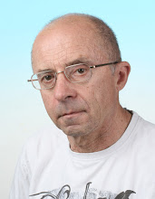

# Chorwacja

## Rijeka – podwójne wodowanie

 Pomysł przewiezienia jachtu trasą kolejową do Chorwacji powstał w maszoperii "Jadrana" (Nefryt). Jacht był nowy, zakładaliśmy więc, że nie będzie ulegał awariom. Chcieliśmy wykorzystać takie jego możliwości, jak w miarę dobre wyposażenie na dłuższe rejsy przy stosunkowo niewielkim ciężarze i wielkości, zdolność do żeglugi po wodach otwartego morza.

Pierwszą przygodę mieliśmy już w Szczecinie. Podczas transportu jachtu wysoką naczepą na dworzec kolejowy, prześwit pod trakcją tramwajową okazał się niebezpiecznie mały. Pod wiaduktem kolejowym na ul. Gdańskiej też były problemy, ale przejechaliśmy prawie na styk. Kolejarze z sympatią odnosili się do nas i do naszego nietypowego ładunku. Dokonali obmiaru skrajni i wyszło, że kadłub zmieści się w chorwackich tunelach.

Sam transport do Chorwacji trwał bardzo długo, chyba około 3 tygodni. Po otrzymaniu wiadomości, że "Jadran" stoi w Rijece na bocznicy, wyjechaliśmy skonsumować zaplanowaną przygodę. Widok jachtu był przygnębiający. Pokład i burty zmieniły kolor na brudno-szary, co sprawiało wrażenie, jakby to był wrak jachtu. Na szczęście nic nie zginęło. Jacht dostarczono do portu w Rijece i tam zwodowano.

Podczas klarowania przeżyliśmy niebezpieczną sytuację. Siedziałem na nadbudówce. W odległości około 50 metrów grupa dokerów kończyła właśnie pracę i szykowała się do przerwy śniadaniowej. Ustawiali swoje pojazdy, ładowarki i ciągniki na parkingu. Niektóre miały niewygaszone silniki. Dokerzy wkrótce poszli na posiłek. W pewnym momencie widzę, jak jeden ciągnik rusza tyłem w naszym kierunku, nabiera rozpędu i szybko zbliża się. Załoga była pod pokładem, krzyknąłem do nich. Gdy wychodzili na pokład, w tym momencie ciągnik zwalił się do wody, parę metrów od rufy, oblewając ją. Byliśmy w lekkim szoku. Żeby szybko zapomnieć o tym zdarzeniu, kapitan zarządził pilne prace na jachcie.

## Epizod sztormowy

Żegluga w Chorwacji należy do tych spokojnych. Jednak trafiają się tam spotkania z wiatrami charakterystycznymi dla Chorwacji: Jugo i Bora. My przeżyliśmy Bora. To spadło nagle. Wieczorem wiatr stężał w ciągu kilku godzin do 8 a może 9 stopni Beauforta. Pojawiła się wysoka i stroma fala. Jacht raczej dryfował niż płynął w zamierzonym kierunku. Kapitan Zaremba zdjął wszystkie żagle i niosło nas z wiatrem oraz falą. "Jadran" (w tłumaczeniu z chorwackiego – "Adriatyk"), zachowywał się jak piłka na wodzie. Tę noc będę długo pamiętał. Zamknęliśmy się w kokpicie i czekaliśmy na uspokojenie się wiatru. Kapitan co jakiś czas wychylał się z kokpitu, robił przegląd świateł i widocznych obiektów. Tylko on wiedział, gdzie jesteśmy. Ja, pomimo usilnych starań nie potrafiłem określić pozycji. Gubiłem się w dużej ilości świateł.

Mój podziw dla kapitana był naprawdę duży. Potrafił przewidzieć kierunek dryfu jachtu oraz czas trwania Bora. Niosło nas w bezpiecznym kierunku. Pomimo tego, oczekiwanie nasycone było niepokojem. Siedzenie i czekanie, aż los rzuci nas tam, gdzie poniekąd chcemy, nie było łatwe. Wiatr ucichł dopiero na drugi dzień przedpołudniem. Wtedy pojawiło się słońce i rejs znowu zaczął nam się podobać.

## Dodatkowe atrakcje

W trakcie manewrów odejścia od boi, na śrubę nawinęła się lina. Wypadło na mnie, ponieważ byłem najsprawniejszy i nieźle pływałem. Rozebrałem się i z nożem w ręku zanurkowałem. Lina była twarda, cięcie szło opornie. Nurkowałem parę razy, aż w końcu przeciąłem ją i resztki zdjąłem z wału śrubowego. Woda była bardzo zimna. Po powrocie na jacht byłem dosłownie siny i całe ciało drżało, niezależnie od mojej woli. Długo się rozgrzewałem.

Nasz rejs odbywał się w maju, a więc przed sezonem. Chcieliśmy poznać ten kraj bez armii turystów i to nam się udało.

Gdy zablokował się fał grota na topie masztu, to trzeba było tam się dostać. Wiele razy wjeżdżałem na ławce bosmańskiej na maszt, ale to były zajęcia w porcie.Teraz akcja będzie na morzu. Wciągnęli mnie. Muszę powiedzieć, że jacht, gdy patrzymy na niego z góry, z nawet tak niewielkiej wysokości (17 metrów), na tle ciemnogranatowej wody, prezentuje się pięknie. Awarię bloczka usunąłem. W trakcie pracy zabrakło mi trzeciej ręki. Przytrzymałem stalowy fał w zębach, które się lekko nadkruszyły, ale była to drobnostka w porównaniu z radością z usunięcia awarii.

## Niespodziewany atak

Przepływając wzdłuż skalistego brzegu, chcieliśmy zakotwiczyć w niewielkiej zatoce.Gdy już byliśmy blisko brzegu, nagle dostaliśmy się pod atak rzucanych kamieni z brzegu. Uciekliśmy stamtąd i zakotwiczyliśmy w innym miejscu - nieopodal. Ten incydent zaciekawił nas. Kto to mógł rzucać? Dwuosobowa delegacja, czyli ja z kolegą dostaliśmy się na brzeg bączkiem, który stale trzymaliśmy na pokładzie. Poszliśmy w podejrzane miejsce. Zaczęliśmy iść szpalerem krzaków, na końcu którego, widać było część stolika. Po dojściu do niego, pojawił się dobrze zbudowany mężczyzna, który tonem nie znoszącym sprzeciwu, kazał zdjąć nam jedyny strój, jakim były spodenki. Sam był w spodenkach. Zapłaciliśmy drobną kwotę za bilety i poszliśmy dalej tą samą drogą, ale już lekko wystraszeni takim rozwojem sytuacji. Nigdy nie byliśmy w Polsce na plaży nudystów, a na taką prawdopodobnie wiodła nas ta ścieżka.. Ku naszemu przerażeniu, z naprzeciwka zbliżała się całkiem naga, mocno opalona kobieta. Ile nas kosztował wysiłek umysłowy i nie tylko, żeby nie dać poznać, że jesteśmy z innej planety, to tylko Bóg wie. Ale udało się. Doszliśmy na samą plażę, a tam tłum ludzi też całkiem gołych. Szybko położyliśmy się na skrawku ziemi i szczęśliwi, bezpieczni, rozglądamy się wokoło. W tłumie spacerujących przeważali ludzie starsi, których ciała nie były symbolami piękna, więc widok nie był najciekawszy. Po pół godzinie zauważyliśmy, że nikt na nas nie zwraca uwagi, co nas bardzo uradowało. Poczuliśmy, że możemy wstać.

Spacer po plaży był dla nas psychicznym i fizycznym odpoczynkiem po długim pobycie na jachcie. Okazało się, że pozbycie się ubrania powoduje poczucie wyzwolenia, a to z kolei pozwala odpocząć całemu organizmowi. Banalnie mówiąc, czuliśmy się częścią natury. Mieliśmy tyle wrażeń, że nie chcieliśmy dochodzić, skąd były te kamienie. Wróciliśmy na jacht.

## Ukryta winiarnia

W pewnym mieście, którego nazwy już nie pamiętam, wybrałem się na spacer. Przechodziłem koło parku i usiadłem na ławce. Obok siedział starszy pan o twarzy mocno pooranej zmarszczkami. Zaczęła się rozmowa. Powiedziałem, że jestem z Polski. Ożywił się. W czasie wojny walczył w jednym oddziale partyzanckim z Polakiem, który był jego przyjacielem. Zaprosił mnie na wino.

Po przejściu paru ulic, stanęliśmy przed bramą domu, na której wisiał pęk słomy i powiedział - to tutaj. Zaraz wyjaśnił, że to znak dla miejscowych. Nie chcą, żeby ktoś obcy tam wchodził, a już na pewno nie Niemcy, których wszędzie było pełno.
W pomieszczeniu o ścianach pomalowanych na biało, stały stoły, ławy i ogromne beczki. Obecni z ciekawością spoglądali na mnie. Mój przewodnik zaraz wszystko wyjaśnił i zauważyłem przyjazne uśmiechy na ich twarzach. Byli to zwykli ludzie, ubrani przeciętnie, przeważnie starsi.

Piliśmy czerwone wytrawne, niestare wino z dużych kubków. Każdy, kto chciał się napić, podchodził do beczki, otwierał kurek i nalewał sobie tyle, ile chciał. Ja piłem za darmo, płacił mój przewodnik.Po kilku kolejkach zauważyłem, że jest dobrze pijany i usnął z głową na stole. Wtedy podchodzili do mnie inni biesiadnicy i też chcieli się ze mną napić, co jak sądzę, mogło być oznaką podziwu. Miałem według nich mocną głowę, a tego się po mnie nie spodziewali. Ja też nie. Opuściłem winiarnię w dobrej kondycji, ale już sam, nie wydając przy tym ani centa.

Polacy są w każdym zakątku świata. Kiedyś wpłynęliśmy późnym wieczorem do położonego wśród lasu, bardzo małego portu, gdzieś na południu Chorwacji. Keja mieściła 2 jachty, wokoło żywej duszy. Po dobrej godzinie, pojawił się jakiś człowiek. Powiedział, że jest Polakiem, byłym partyzantem, który walczył na tym terenie, tu poznał żonę i tu pozostał.
Spotkania z rodakami i ślady ich pobytów w Chorwacji, to mniej znany wątek tego rejsu.

Lubię spacerować samemu po zakątkach miasta, nie często odwiedzanych przez turystów. Inna jest wówczas percepcja odbieranych wrażeń. Można spotkać i poznać ciekawych ludzi. Polecam ten sposób uprawiania turystyki.

## Wyroby ze srebra - biżuteria i ozdoby

Nasz rejs odbywał się przed sezonem turystycznym. W rodzinnych sklepikach na małych wyspach byliśmy jednymi z nielicznych klientów. Wykorzystywaliśmy tę okoliczność do starań o obniżenie cen za kupowane ozdoby dla naszych żon i kobiet. W trakcie negocjacji, które trwały godzinami, wychodziliśmy wielokrotnie ze sklepu, a po chwili sprzedawca po nas wybiegał i wciągał z powrotem. Dużo nauczyłem się od Zbyszka, który pokazał mistrzostwo w targowaniu.

Wyroby były prześliczne. W oprawach ze srebrnego drutu łączonego według motywów ze świata roślin, osadzane były: korale białe, czerwone, kamienie półszlachetne, perły. Kupowaliśmy też naszyjniki i bransolety z korali. Sprzedawcy udowadniali nam, że sprzedają ze stratą, ale po zakończeniu transakcji, nagle zmieniali się w zadowolonych, gratulowali nam talentu do targowania. Dla nich sama czynność targowania, była czymś niezbędnym do samozadowolenia - była sensem ich pracy.

Link do oryginalnego artykułu: [Chorwacja](http://kinkiet78.blogspot.com/2012/11/chorwacja-rijeka-podwojne-wodowanie.html)
