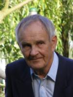
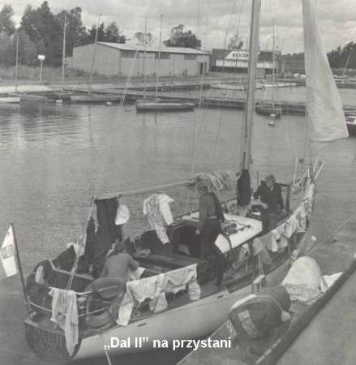

# Ostatni Rejs

> 
...Uchwyt lądu na stępce okrętu, nawet jeśli nie ma skutków gorszych niż zniszczenie takelunku i strata czasu, zapada w pamięć marynarza niezatartym posmakiem klęski.

> 
Okręt może być „wyrzucony na brzeg:” przez burzę. Jest to klęska, katastrofa. Natomiast w „wejściu na brzeg” tkwi małość, dotkliwość i gorycz ludzkiego błędu.

> <cite>Joseph Conrad „Zwierciadło morza”</cite>

 Nad tym rejsem od początku wisiało jakieś złe fatum: stale coś szło zupełnie nie tak, jak miało iść. Później, kiedy jego pechowość stała się dotkliwie oczywista, doliczyłem się, że był to mój trzynasty rejs od czasu przejęcia opieki nad DALĄ...

 Zaczęło się od tratwy, jeśli nie liczyć pogody, która wręcz uniemożliwiała doprowadzenie stojącego „pod chmurką” jachtu do stanu i wyglądu od lat uznawanych przez nas za normalne. Kupioną przed rokiem (wprawdzie używaną ale podobno znajdującą się w świetnym stanie) tratwę PRS - zamiast atestem - obdarzył znakiem kasacji. Gdy poszukiwania jakiejś używanej, ale dobrej i niezbyt drogiej tratwy nie dały rezultatu zainteresowałem się nowymi. Przegląd rynku pokazał, że najtańszą jest tratwa ZODIAC w miękkim opakowaniu. Kiedy Klub, po kilkutygodniowych wahaniach, zdecydował się ją zamówić realny termin dostawy wypadał dwa tygodnie po planowym rozpoczęciu rejsu. Wobec takiej perspektywy Jurek Madeja polecił mi wziąć tratwę UMBRIAGI. Aktualnie pływała ona na ŻAKU, ale ten, w piątek 17-go lipca, miał kończyć rejs; nie było więc problemu. Czekaliśmy: piątek - nic, sobota - nic, niedziela - jak wyżej. W poniedziałek, zamiast ŻAKA, przyszła informacja że zmienił on w Gdańsku załogę i pożeglował dalej... Dalsze, bardzo już nerwowe, poszukiwania przyniosły efekt: Pan Kazimierz Ozon pożyczył nam swoją tratwę PLASTIMO.

Nie wykluczone, że to właśnie trwająca od szeregu tygodni presja wielu spraw i terminów istotnych dla rejsu, załogi i jachtu doprowadziły moje serce do stanu, który 16-go lipca kazał wezwanemu lekarzowi wypisać mi skierowanie do szpitala. Skierowanie „skierowałem” do szuflady, bo w składzie załogi nie było nikogo kto (zgodnie z przepisami) mógłby mnie zastąpić. Uzupełniłem swoją prywatną, z innych powodów już sporą, apteczkę o kolejne leki, jednak - robiąc dobrą twarz do złej gry –w głębi ducha bardzo się bałem czekającego mnie 50-cio dniowego rejsu.

Kompletowanie załogi też nie szło bez zacięć. Po raz pierwszy od pięciu sezonów Jola Boehm nie zdecydowała się na przylot od Szczecina. Doskonale znający jacht, bardzo solidny i doświadczony „pierwszy” odpadła - choć obecne przepisy pozwalały obsadzić tą funkcję sternikiem jachtowym - trudno to było uznać za rozwiązanie równoważne. Zbyszek Cieśla miał pilną pracę i też nie mógł płynąć, to była kolejna wielka strata. Ostatecznie cztery osoby miały żeglować przez całą trasę, to znaczy Londyn, Edynburg, Stavanger, Kopenhaga Szczecin, zaś dwie pozostałe miały zostać zmienione w Londynie. Termin wymiany został ustalany na 12-go sierpnia, bilety na autobus zarezerwowano.

W środę 22-go lipca o 1235 jacht opuścił przystań klubową - jak się to miało okazać - na zawsze. W Trzebieży zatankowaliśmy paliwo i wieczorem stanęliśmy w świnoujskiej pseudomarinie przy Władysława IV. W ŁUNOWIE i KOTWICY udało mi się pożyczyć ostatnie brakujące mapy oraz locję Skageraku i koło południa 23-go wyszliśmy z portu. Wylewając do morza kieliszek winiaku z pokorą prosiłem Pana Mórz by był dla nas łaskawy i zechciał nam oszczędzić skrajnie trudnych doświadczeń...

Powyżej Arkony, idąc pod silny zachodni wiatr, zostaliśmy zaniepokojeni zapachem ropy. Aby sprawdzić przyczynę wieczorem 24-go weszliśmy do Warnemünde. Sprawa wyjaśniła się szybko: przez źle zakręconą nakrętkę wlewu paliwa wychlapywała się ropa. Po wypraniu i wysuszeniu rzeczy następnego dnia około 15-tej ruszyliśmy dalej. Żeglując przeciw westowej piątce 26-go o 19-tej weszliśmy do dużej śluzy Holtenau. Po nocy spędzonej na kotwicowisku Flemhunder See około 1630 osiągnęliśmy śluzę Brunsbüttel i o 21-szej stanęliśmy na cumach w marinie Cuxhaven. Następnego dnia kupiłem tabele pływów dla portów niemieckich i rodzaj żeglarskiej locji „Nordsee Revire”. Przed wyjściem (1720) odwiedził nas Andrzej Piotrowski i Jerzy Knabbe, którzy w trzy jachty (w tym GEMINI) płynęli do Gibraltaru. Następne dni nie były ani miłe ani łatwe: żeglowaliśmy pod silny (do 34 węzłów) zachodni wiatr. Było mokro, chłodno i rzygliwie, ale życie załogi utrzymywało się w ramach rejsowej rutyny. Być może chłód tych dni i skutki kilku zimnych pryszniców, których nie udało mi się uniknąć, spowodowały nawrót zapalenia pęcherza. Przez szereg dni łykając pigułki męczyłem się piekielnie. Przesilenie miało przyjść dopiero w Amsterdamie. Tuż po północy, już 1-go sierpnia, stanęliśmy w nowej, bardzo pięknej i równie drogiej marinie Ijmuiden, by o świcie ruszyć dalej. Nieco po 10-tej stanęliśmy na cumach w amsterdamskiej marinie Sixhaven, gdzie czekały już szybsze jachty naszych gości z Cuxhaven. Dwa dni pobytu w zawsze pięknym i zawsze niezmiernie barwnym Amsterdamie minęły błyskawicznie.

Wieczorem 2-go byliśmy znów na morzu, by następnego dnia o 1430 zacumować w marinie Veerhaven w Rotterdamie. Czwartego sierpnia, przed sklepem, gdzie chciałem kupić (a później kupiłem) brytyjską flagę komplementacyjną i tabele pływów, udającej policjantów grupie farmazonów udało się ukraść mi 300 dolarów. Zawstydzony, że dałem się podejść jak dziecko, nic nie powiedziałem załodze. Z mariny odeszliśmy ok. 1630. Obiad przerwał nam gwałtowny wstrząs. Sternik, z zupełnie niezrozumiałych powodów, nie zwracając uwagi na zmianę charakteru fali, wyszedł za ogromne pale znakujące tor wodny i wpakował nas na podwodny garb o głębokości (wg mapy) 0,9 m! Dość silny prąd odpływu przyciskał nas, jednak przy pomocy silnika i spinakerbomu udało się w ciągu kilku minut odwrócić jacht i powrócić na tor wodny. Po chwili podpłynęła do nas motorówka Kapitanatu Portu z pytaniem, czy nie potrzebujemy pomocy? Radaryzacja portu działa tu niewątpliwie skutecznie. Uszkodzeń nie stwierdziliśmy, więc podziękowaliśmy. Niewiele dalej łódź policyjna poleciła nam wejść do basenu Buitenhaven, gdzie dokładnie sprawdzono dokumenty jachtu i uprawnienia załogi. Nie było to przyjemne, choć policjanci byli naprawdę grzeczni. Kwadrans po 20-tej byliśmy na morzu. Przy stawianiu genui fał zaciął się tak, że nie można było żagla ani do końca postawić, ani też zrzucić. Zawróciliśmy i o 2240 staliśmy przy pirsie basenu Berghaven w Hook van Holland. Ze względu na awarię pozwolono nam stanąć w tym, normalnie nie dostępnym dla jachtów, basenie. Na topie masztu stwierdziłem, że rolka fału foka wymaga wymiany, gdyż jej wewnętrzny otwór jest skrajnie wyrobiony. Dzięki negocjacyjnym zdolnościom Dominiki nową rolkę wykonał nam (gratisowo, jeśli nie liczyć butelki Poloneza i paczki pierniczków) tokarz w warsztatach naprawczych bazy pilotów.

Około 13-tej 5-go sierpnia ruszyliśmy dalej, by następnego dnia w południe stanąć w dużej i pełnej pięknych jachtów marinie Zeebrugge. Korzystając z bliskości Bruggi odwiedziliśmy to niezmiernie ciekawe i piękne miasteczko, ja jeździłem tam nawet dwukrotnie. Siódmego pod wieczór wyszliśmy z portu by następnego dnia po 10-tej stanąć w jachtowym porcie Dunkierki

Rankiem 9-go sierpnia za wszystkie pozostałe franki uzupełniliśmy zapas paliwa i około południa wyszliśmy na morze. Biegnące równolegle do wybrzeża piaszczyste ławice zmuszały nas by płynąć w kierunku Calais. Dopiero tam można było przyjąć kurs na wejście do Tamizy. Włączona natychmiast po wyjściu z portu echosonda z chwilą kiedy głębokość przekroczyła 120 ft zaczęła błędnie wskazywać i włączać alarm, więc została wyłączona. Po czystym przecięciu głównego toru wodnego prowadzącego do Kanału Angielskiego żeglowaliśmy w kierunku wejścia do North Edinburgh Channel. GPS ustawiłem na bliski tego wejścia punkt o współrzędnych: N51°32’, E001°23’, cała oś żeglugi leżała na wodach o głębokości powyżej 10 m. Wiała piątka z sektora NE - N. Jacht spokojnie płynął z szybkością ok. 5,5 węzła. Kurs kompasowy ustalałem tak, by wskazywane przez GPS kursy nad dnem; rzeczywisty i docelowy były jednakowe. O 19-tej odnotowano w dzienniku pozycję: N51°23,11’, E001°34,41’; jacht w tym czasie płynął kursem kompasowym 310°. O 1940 naniosłem na mapę kolejną pozycję, która nie odbiegała od obranej osi żeglugi. Do kolacji siedliśmy po zmianie wachty o 2000. Byłem zupełnie odprężony. Połowa rejsu praktycznie była za mną, dalsza jego część to miały być długie, więc bardziej spokojne przeloty, kłopoty zdrowotne ustąpiły a na wszelki wypadek miałem jeszcze spory zapas leków, jacht był uporządkowany i w pełni sprawny, kurs zupełnie bezpieczny.

Pierwsze silne uderzenie o dno, które odczuliśmy około godz. 2045 było całkowitym zaskoczeniem. Wyszedłem na pokład. Kształt fali był charakterystyczny dla spłyceń. Natychmiast uruchomiłem silnik i wykorzystując go razem z żaglami starałem się obrócić jacht na kontra kurs. Bezskutecznie. Poleciłem zrzucić żagle i przygotować kotwicę CQR. Nadal starałem się obrócić jacht przy pomocy silnika, nadal bez rezultatu. Określiłem pozycję - leżała daleko po zawietrznej od założonego kursu. Kilka fal wlało się przez luki, więc poleciłem odkryć podłogę w messie. W zęzie było dużo wody, zaczęto ją wyczerpywać 2-ma wiadrami. Widząc bezskuteczność pracy silnika zgasiłem go i kazałem rzucić kotwicę. Ktoś puścił końcówkę łańcucha. Jej ponowne wyciągnięcie z komory łańcuchowej znacznie opóźniło rzucenie kotwicy. Liczyłem na przypływ, następna wysoka woda była za 5 godz. Jacht nadal twardo uderzał o dno, wstrząsy masztu sprawiały mi wręcz fizyczny ból. Jak sygnał alarmowy paliło się w messie czerwone światło oświetlające wskaźniki, był to wynik zalania wodą tabliczki sternika w prawej jaskółce kokpitu. Intensywne wyczerpywanie wody przez cztery osoby wydawało się dawać rezultaty - poziom w zęzie obniżał się. Jacht zaczął się prostować, uderzenia jakby ucichły, sukces wydawał się być blisko. Niestety! - po kilku minutach znów nastąpiła seria bardzo silnych uderzeń i przechył wzrósł. Napływ wody od strony dzioby stawał się wyraźny. Około 2200 oceniłem, że nie potrafimy go już opanować i poleciłem nadać MAYDAY, podając pozycję aktualnie wskazywaną przez GPS tj N51°26,620’ E001°022,490’. Ze względu na znajomość języka wykonał to i korespondencję w niebezpieczeństwie prowadził Michał. Wisząca przy UKF-ce instrukcja wzywania pomocy przydała się. Nadal wybieraliśmy wodę. Muszę podkreślić znakomitą postawę załogi w krytycznych warunkach. Nie było żadnych oznak paniki, żadnego oszczędzania się, każdy robił wszystko co można było dla uratowania jachtu.

Poleciłem przygotować się do opuszczenia jachtu, przygotować koła i pasy ratunkowe oraz tratwę pneumatyczną. Sam zebrałem dokumenty jachtu i załogi oraz pieniądza. Przybór wody był już tak duży, że zaczęła ona - na przechylonym na prawą burtę jachcie - zalewać tablicę rozdzielczą i zagrażać radiotelefonowi. Twardo przestrzegana zasada stałej lokalizacji wyposażenia wykazywała teraz swoje zalety: nurkując w zapadającej ciemności pod metrową już warstwę wody bez szukania wydobyłem rakietę spadochronową i wystrzeliłem ją by wskazać drogę helikopterowi, którego światła zaczęły być widoczne. Nasze oświetlenie pokładu też paliło się jeszcze. Otworzyliśmy tratwę, niestety odwrotnie. Po przywróceniu jej prawidłowego położenia wsiedliśmy do niej, pozostawiając linę zaczepioną do topenanty grota. Po chwili helikopter zawisł nad nami, oświetlając nas reflektorem. Ratownik na linie był tuż nad wodą. Widząc, że takelunek jachtu będzie mu przeszkadzał odciąłem linę łączącą nas z jachtem. Tratwa zaczęła szybko dryfować. Ratownik wskoczył do niej i po dwie osoby, szybko ekspediował nas na pokład helikoptera.

Po kilko minutach lotu, koło 23-ciej, wylądowaliśmy na terenie szpitala w Margate, gdzie czekał na nas personel medyczny i - sądząc po strojach- Straż Pożarna. Widać taki tu zwyczaj. Po zmianie ociekających wodą ubrań na szpitalne fartuchy, poddano nas rutynowym badaniom. Pomiar temperatury ciała (dokonywany w uchu) wykazał w moim przypadku 33,7°, co się pielęgniarce na tyle nie podobało , że przykryto mnie kocami. Inni nie zaznali takich luksusów. Dostaliśmy dużo gorącej herbaty. Nad ranem uprzejmy personel szpitala znalazł dla nas miejsca w hotelu i wezwał taksówki, które nas tam - nadal w szpitalnych fartuchach - przewiozły. Tej nocy nie udało mi się zasnąć. Obserwacje, pytania i wątpliwości przebijały się przez gorycz klęski. Próbowałem utworzyć spójny obraz zdarzeń. Następnego ranka telefoniczne poszukiwaliśmy londyńskiego Komisarza Awaryjnego Hestii. Dzięki pomocy Pana Konsula w Londynie, a przede wszystkim „uruchomionego” przez Dominikę Pawła Maciejaka w Szczecinie, nawiązaliśmy odpowiedni kontakt. Przekazaliśmy też informację osobom które miały uzupełnić załogę w Londynie. Personel hotelowy uprał i wysuszył nasze ubrania, jak się później miało okazać nie tylko z dobrego serca. Pozwoliło to nam oddać szpitalowi fartuchy, w których przyjechaliśmy do hotelu. Poprosiłem wszystkich członków załogi o spisanie wspomnień z okresu awarii i bezpośrednio przed nią oraz sporządzenie list utraconych rzeczy osobistych. Nadal było dla mnie tajemnicą, jak powstało tak duże zejście z kursy. Trochę wyjaśniła informacja przejmującej wachtę Ani, że poprzedni sternik przekazał jej kurs 300° choć od dwóch godzin jacht miał płynąć kursem 310°).

Utrzymywaliśmy telefoniczną łączność ze Strażą Przybrzeżną, która nas poinformowała, że jacht stracił balast, ma złamany maszt i dryfuje. (Do dziś nie mogę tego zrozumieć: 30-to kilowa CQR powinna była utrzymać jacht, szczególnie pozbawiony balastu.) Tego samego dnia powiadomiono nas, że około 1500 wrak zniknął z ekranów radarów. Podali ostatnią zaobserwowaną pozycję:          N51°24,30’, E001°25,42’. To przekonywało tak Komisarza Awaryjnego jak i mnie że strata jest nieodwołalna i całkowita. Trochę dodatkowych informacji zebrał Michał, który na pożyczonym z wypożyczalni rowerze objechał okoliczne brzegi. Dostaliśmy kolejną pozycję (podobno z 2105) N51°23,920, E001°27,49.

Komisarz Awaryjny uznał nasz dalszy pobyt w Anglii za niepotrzebny. Aby się zbytnio nie wyróżniać kupiliśmy sobie w sklepie z używaną odzieżą trochę tanich ciuchów, ja kupiłem także buty, gdyż moje trampki nie nadawały się do użytku. Komisarz Awaryjny, f-ma Gdynia - America Line, zapewnił opłacenie hotelu i dojazdu do Londynu, dał diety i dostarczył nam bilety na autobus do Szczecina. Ze względu na brak miejsc wracaliśmy w 2-ch grupach: 4 osoby 12-go a Michał i Krzysztof 16-go sierpnia. Z Margate na Dworzec Victorii, dowiózł nas hotelowy mikrobus. Sprawdziły się prognozy przekazane nam z GAL: przez przedmieścia Londynu jechaliśmy w wielokilometrowym korku, z szybkością około 5 km/godz. Pierwsza grupa na oglądanie miasta zupełnie nie miała czasu; pod tym względem w lepszej sytuacji byli odjeżdżający 16-go.

Po powrocie opracowałem kartę rejsu i - zgodnie z życzeniem Komandora - pisemną informację dla Zarządu Klubu. We wtorek 18-go Michał uzyskał z PŻM-u kserokopię mapy estuarium Tamizy i odpowiedniej tabeli pływów. Wspólnie przeanalizowaliśmy prawdopodobną drogę jachtu od 1900 kiedy po raz ostatni zanotowano w dzienniku pozycję do pozycji, którą podaliśmy przy wezwaniu MAYDAY. Ta analiza wykazywała, że konieczne było zsumowania się skutków kilku błędów by doprowadzić do awarii. W czwartek 20-go zebrała się u mnie cała (z wyjątkiem Ewy, której nie było w Szczecinie) załoga. Omówiliśmy ówczesną i obecną sytuację. Ze swej strony starałem się przekazać wnioski które im w ich przyszłej aktywności żeglarskiej mogą się przydać. Najważniejszym wydaje się konsekwentne trzymanie się zasad rutyny, niezależnie od doskonałości posiadanego wyposażenia nawigacyjnego i pozornej bezproblemowości sytuacji. Każde zlekceważenie zasad, przy braku odrobiny szczęścia, może okazać się tragiczne. A szczęście - jak wiadomo - na pstrym koniu jeździ...

[ Ziemowit Ostrowski ](https://jkazs.szn.pl/stara-strona/content/ziemowit-ostrowski.html)
