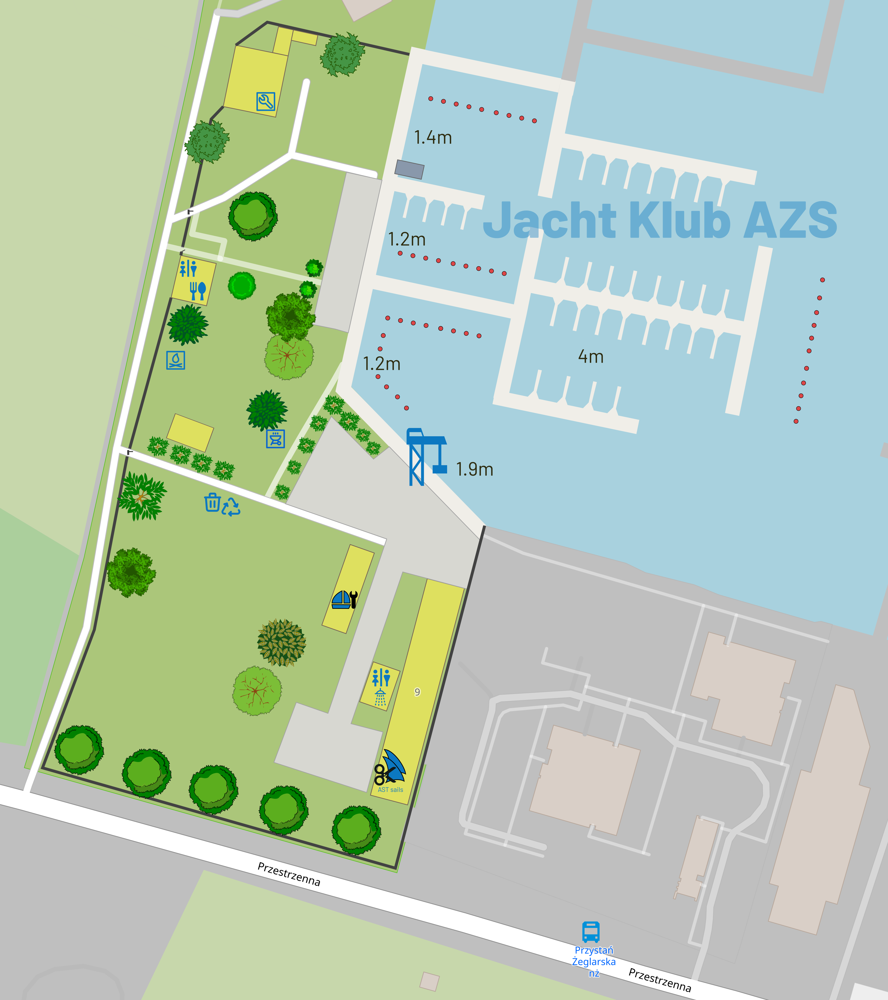

## Beschreibung

Der AZS Yacht Club befindet sich im südlichen Teil des Dąbie-Sees. Der vor Wellen und Wind geschützte Hafen schafft komfortable Bedingungen zum Anlegen von Yachten.

Im ersten Stock des Clubgebäudes gibt es eine TAVERNE und alles, was Sie brauchen, um Kalorien und Durst aller Art zu stillen. Vor Ort gibt es eine Segelwerkstatt von AST SAILS und eine Bootsbauwerkstatt. Vom Club in die Stadt zu gelangen ist sehr einfach. Wir nutzen öffentliche Verkehrsmittel. Die Bushaltestelle befindet sich in der Nähe des Eingangstors.

## Grundinformationen

| Geben Sie                   | ein Daten                                                                                                                            |
|---                          |---                                                                                                                                   |
| Adresse                     | Jacht Klub AZS Szczecin   ul. Przestrzenna 9   70-800 Stettin                                                                |
| E-Mail                      | jkazs.szn@gmail.com                                                                                                                  |
| Bürotelefonnummer           | + 48 91 461 27 34                                                                                                                    |
| Telefon mit dem Bootsmann   | +48 600 233 221                                                                                                                      |
| Büroöffnungszeiten          | MONTAG 9.00 - 15.30   DIENSTAG 9.00 - 17.30   MITTWOCH 9.00 - 18.00   DONNERSTAG 9.00 - 17.30   FREITAG 9.00 - 16.30 |
| Steueridentifikationsnummer | 955-00-05-467                                                                                                                        |
| Konto                       | BOŚ S.A. O/Szczecin 92 1540 1085 2098 5313 3504 0001                                                                             |

## Standort

Eine Bucht im südwestlichen Teil des Dąbie-Małe-Sees.

Standort auf Karten: [OpenStreetMap](https://www.openstreetmap.org/node/2396250849), [Google Maps](http://maps.google.com/maps/ms?ie=UTF8&hl=en&t=h&msa=0&msid=107138309144250252667.00047ce94cdeb26e4583f&ll=53.396458,14.621472&spn=0.008956,0.018239&z=15&source=embe)

## Liegeplatzbedingungen für Yachten

Die Yacht bleibt bis zu 3 Stunden kostenfrei. Die Parkgebühr pro Tag richtet sich nach der Länge der Wohneinheit.

[Gästeparkplatzreservierung.](Gästeparkplatzreservierung)

### Preisliste der Gebühren für das Anlegen von Gastyachten in der Saison 2024

| Länge      | Preis              |
|---         |---                 |
| bis 5,99 m | 65 PLN / Tag       |
| 6-7,99 m   | 70 PLN / Tag       |
| 8-9,99 m   | 80 PLN / Tag       |
| 10-11,99 m | 90 PLN / Tag       |
| 12-13,99 m | 105 PLN / Tag       |
| 14-15,99 m | 120 PLN / Tag      |
| 16-17,99 m | 145 PLN / Tag      |
| über 18 m  | Preis ausgehandelt |

### Zusätzliche Gebühren

  - Nebenkosten (Wasser, Strom) - 20 PLN / Tag
  - Dusche - 15 PLN / Stück,
  - Aufstellen und Ablegen des Mastes – 120 PLN

### Sonstige Gebühren

| Gattung                                                                            | Preis                                                                          |
|---                                                                                 |---                                                                             |
| Campingwagen                                                                       | 150 PLN / Tag                                                                  |
| Auto mit Campinganhänger                                                           | 150 PLN / Tag                                                                  |
| 1-2 Personen Zelt                                                                  | 40 PLN / Tag                                                                   |
| 3-6 Personen Zelt                                                                  | 55 PLN / Tag                                                                   |
| Aufenthalt für 1 Person                                                            | 45 PLN / Tag                                                                   |
| Aufenthalt von 1 Kind bis 13 Jahre                                                 | 25 PLN / Tag                                                                   |
| Hundeaufenthalt                                                                    | 20 PLN / Tag                                                                   |
| Ein Auto ohne Plakette parken                                                      | 20 PLN / Tag                                                                   |
| Abstellen eines Bootsanhängers bis 6 m                                             | 20 PLN / Tag                                                                   |
| Parken eines Bootsanhängers über 6 m                                               | 25 PLN / Tag                                                                   |
| Benutzung der Waschmaschine                                                        | 25 PLN / Stück                                                                 |
| Abstellen ausländischer Schiffe (zur Renovierung) an Land, am Kai und in der Halle | individuell festgelegte Preise + Stromgebühr (nach Zählerständen) + Müllgebühr |

Detaillierte Informationen im Vereinsbüro.

### Dienstleistungen im Yachthafen verfügbar

Mastkran, Taverne, Bootsbauwerkstatt, AST Sails Segelhaus vor Ort, Tankstelle 300 m, Lebensmittelgeschäft 3 km, Segelgeschäft 100 m.

Für Yachten mit Anhänger, Motorroller und Motorboote ist das Ausrutschen auf der Metallrutsche verboten.
