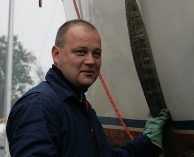

## Skład zarządu Jacht Klubu AZS

### Zarząd Klubu

| Stanowisko                        | Osoba                   |                                               |
|---                                |---                      |---                                            |
| Komandor:                         | **Witold Zdrojewski**   |  |
| Wicekomandor ds. organiz.:        | **Robert Gołąb**        |       |
| Skarbnik:                         | **Marek Stoeck**        |
| Czł. ds. łącz. z młodz. i stud.:  | **Dariusz Sakowicz**    |
| Czł. ds. społ.:                   | **Stanisław Pietracha** |
| Członek ds. tech.:                | **Tadeusz Kiszka**      |

### Komisja Rewizyjna

| Stanowisko         | Osoba                  |
|---                 |---                     |
| Przewodniczący     | **Maciej Szuberla**    |
| Wiceprzewodniczący | **Marek Hermach**      |
| Sekretarz          | **Bartosz Kraczowski** |

### Sąd Koleżeński

| Stanowisko         | Osoba                  |
|---                 |---                     |
| Przewodniczący     | Marek Wróblewski       |
| Sekretarz          | Seweryn Niemiec        |
| Członek            | Witold Brzeziński      |
| Członek            | Joanna Frycz           |
| Członek            | Maciej Korek           |
