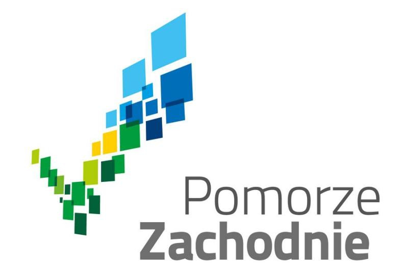

# Koncert Orkiestry Symfonicznej Filharmonii w Szczecinie pt. Muzyka na wodzie

28 czerwca o godz. 21:00 zapraszamy na tradycyjny czerwcowy koncert Muzyka na wodzie.
Tym razem na przystani Jacht Klubu AZS nad Jeziorem Dąbie zabrzmią piosenki z repertuaru Heleny Majdaniec w nowej, orkiestrowej odsłonie.
Wstęp na wydarzenie jest bezpłatny.

## Data i miejsce

28 czerwca w piątek o 21:00
Muzyka na wodzie Jana Waraczewskiego
Przystań Jacht Klubu AZS, ul. Przestrzenna 9

## Organizatorzy

- [Filharmonia im. Mieczysława Karłowicza w Szczecinie](https://www.facebook.com/filharmoniaszczecin)
- JK AZS Szczecin

## Partnerzy

- [Pomorze Zachodnie](https://www.facebook.com/PomZachodnie), [Pomorze Zachodnie News](https://www.facebook.com/PomorzeZachodnieNews)
- [Żegluga Szczecińska Turystyka Wydarzenia](https://www.facebook.com/ZeglugaSzczecinska)

## Sponsorzy

- [CALBUD Sp. z o. o. ](https://calbud.com.pl/)
- [Calesco SA ](http://calesco.pl)
- [Enea Operator Sp. z o. o. ](https://www.operator.enea.pl/)
- [Intergas Sp. z o. o. ](http://intergas.pl/)
- [Marco Marine Sp. z o. o. ](https://marcomarine.pl/)
- [MARINA DEVELOPER Sp. z o. o. ](https://marina-developer.pl/)
- [Stacje Paliw Bobryk Bobryk Sp. J. ](https://www.bobryk.pl/)
- [Zachodniopomorski Uniwersytet Technologiczny w Szczecinie](https://www.zut.edu.pl)
- [Remondis Szczecin Sp. z o. o.](https://www.remondis-szczecin.pl/)
- [CSL Sp. z o. o. ]( https://csl.com.pl/ )
- Millennium Sp. J.

## Repertuar

Piosenki Heleny Majdaniec w wykonaniu _Szczecin Philharmonic Big Band_ muzyków Orkiestry Filharmonii w Szczecinie:

- Anna Biniek - wokal
- Kasia Buja Kazuba - wokal
- Magdalena Wilento - wokal
- Olek Różanek - wokal
- Krzysztof Baranowski - aranżacje piosenek, koncepcja artystyczna, kierownictwo muzyczne
- Patryk Walczak - aranżacje piosenek
- Jakub Kraszewski - dyrygent

W programie koncertu piosenki z repertuaru Heleny Majdaniec, m.in. _Zakochani są wśród nas_, _Rudy rydz_, _Czarny Ali Baba_, czy _Jutro będzie dobry dzień_.

## Informacje praktyczne

🅿️ parkowanie przebiega sprawnie, ale jest nieco czasochłonne, zatem nie radzimy przybywać na ostatnią chwilę.

🦟 warto uwzględnić położenie przystani - chłodne wieczory potrafią zaskoczyć, a i komary z Lubczyny lubią wpaść na koncert;

☂️ zamówiliśmy pogodę idealną, niemniej prosimy o przygotowanie kurtek przeciwdeszczowych i peleryn. Parasole chronią wprawdzie użytkownika, ale podlewają podstępnie sąsiadów, o ograniczonej widoczności i zagrożonych oczach innych melomanów nie wspominając.

## Loga

- 
- 
- 
