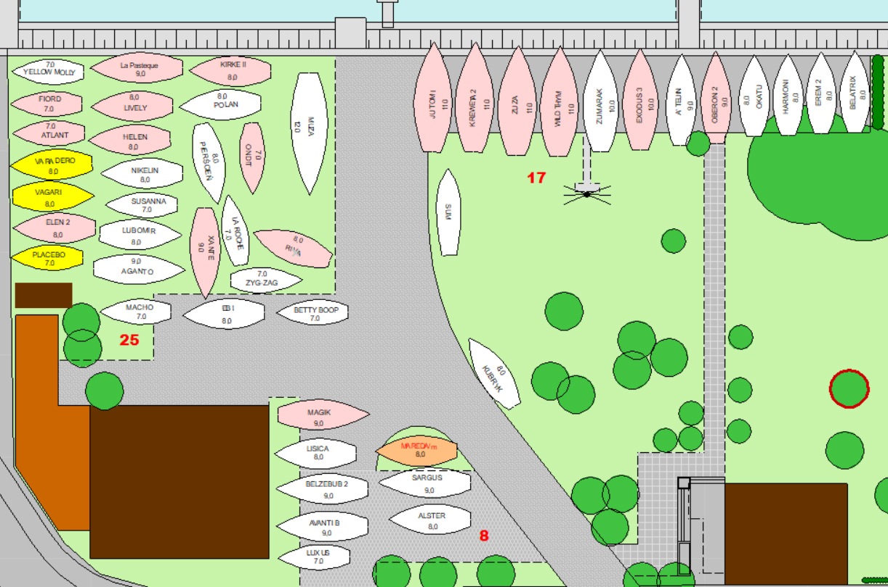
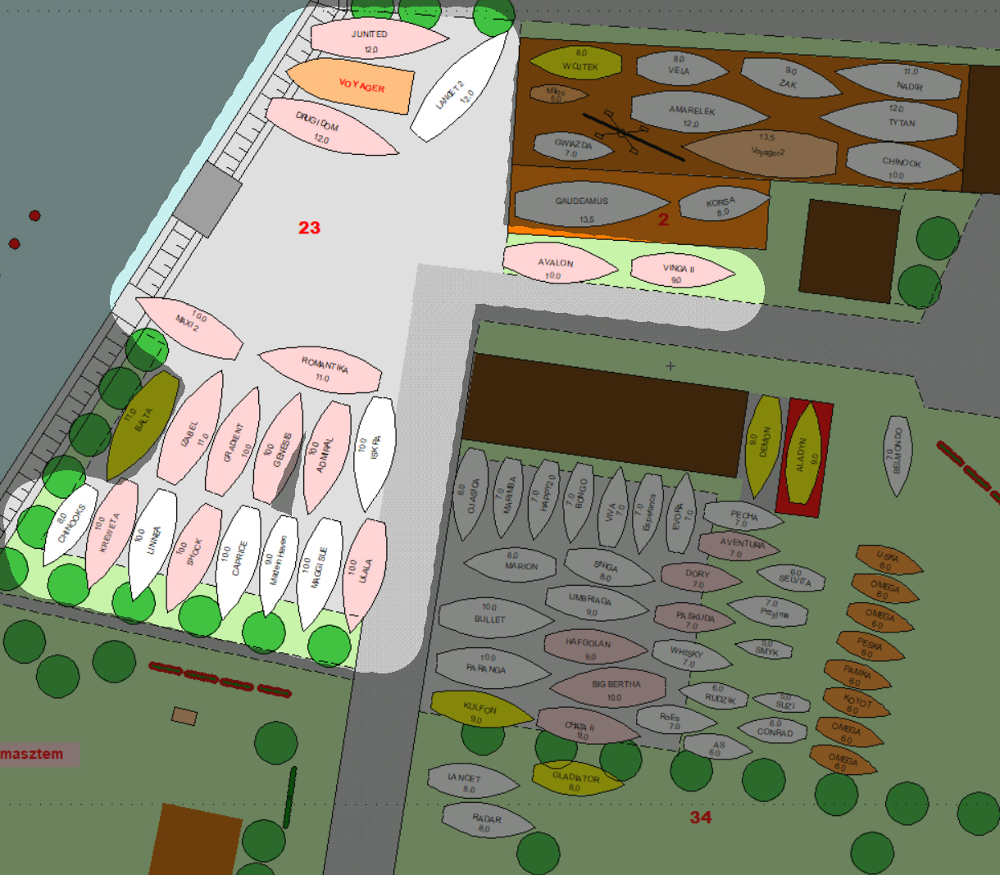
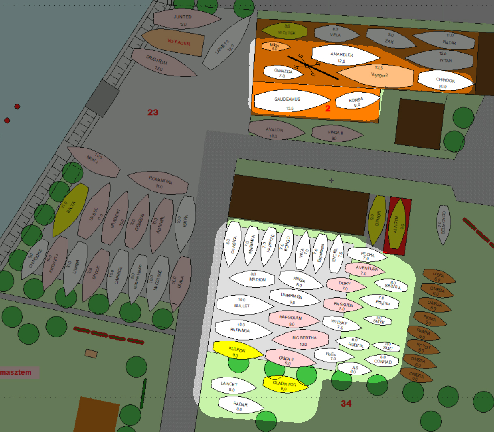

# Wodowanie 2025

Dźwigi zaczynają pracę o godz. 8:00.
Armatorzy i opiekunowie jachtów proszeni są o wcześniejsze przybycie.
Przypominamy, że obecność armatora/opiekuna jachtu podczas wodowania jest obowiązkowa.
Przypominamy spóźnialskim o konieczności opłacenia zaległości, m.in. kosztów slipowania i nieodpracowanych godzin statutowych 2024.
Wodowane będą wyłącznie jachty bez zaległości.

## Pierwszy termin wodowania - 12 kwietnia

Wodowanie dwoma dźwigami od godziny 8:00.

**Przy wiacie** wszystkie jachty w jednym terminie, jak na rysunku poniżej. .

**Przy hangarze** jachty podświetlone na poniższym rysunku. 

## Drugi termin wodowania - 26 kwietnia

Drugi termin wodowania to 26 kwietnia, od godziny 8:00.
Tylko jeden dźwig przy hangarze dla jachtów z rysunku poniżej. .
